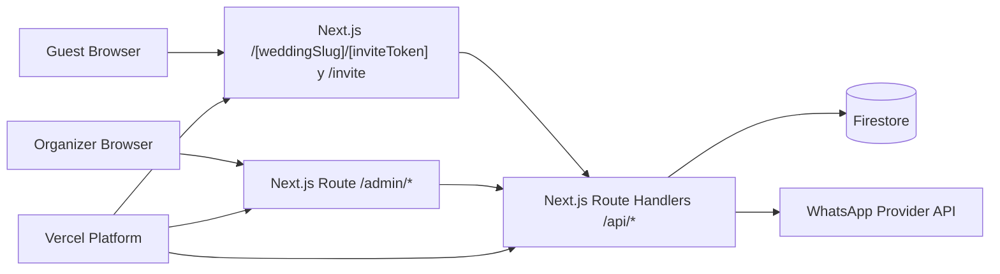

# Wedding App - Technical README (Release 1)

This document defines how Release 1 should be built using the required stack:

- Next.js
- Firestore
- Vercel

It translates the product experience from `EXPERIENCE_README.md` into a concrete technical architecture.

## 1) Objectives of Release 1

Release 1 must deliver:

- Wedding setup and event configuration by organizers
- Guest management with +1 rules
- Unique guest links: checklist `/{slug}/{id_invitacion}`, RSVP `/{slug}/{id_invitacion}/invite` (legado `/{slug}/invite/{id_invitacion}` redirige al checklist)
- RSVP flow (main guest and +1 when applicable)
- Table assignment and visibility for guests
- Dietary restrictions capture
- Announcements feed
- Map actions (Waze + Google Maps)
- WhatsApp invitation dispatch when guest has phone

## 2) Core Stack and Technical Choices

### Mandatory stack

- **Frontend + Backend runtime:** Next.js (App Router)
- **Database:** Firestore (Native mode)
- **Deployment:** Vercel

### Additional decisions

- **Auth (admin):** Firebase Authentication (Email Link or Google provider)
- **Admin data access:** Firebase Admin SDK in server-side routes/actions only
- **UI:** Tailwind CSS + accessible component primitives
- **Validation:** Zod for request and form validation
- **Observability:** Vercel logs + structured server logs
- **Background tasks (initial):** Vercel Cron + Firestore queue documents

## 3) High-Level Architecture



### Runtime boundaries

- **Public guest pages:** server-rendered for fast first load and token validation.
- **Admin pages:** authenticated app area under `/admin`.
- **Mutations:** only via server handlers/actions; no direct client writes to Firestore for privileged data.

## 4) URL and Routing Strategy

### Public URLs (required)

- **Checklist invitado (entrada principal compartible):** `https://eventapp.com/{slug}/{id_invitacion}` — pendientes (RSVP, +1, alergias, etc.), galería placeholder, avisos.
- **RSVP / datos del matrimonio:** `https://eventapp.com/{slug}/{id_invitacion}/invite` — hero, fecha, ubicación, formulario confirmar/rechazar (+1, alergias). Tras guardar correctamente se navega de vuelta al checklist.
- **Detalles:** `https://eventapp.com/{slug}/{id_invitacion}/details` — fecha, lugar, mesa, mapas.
- **Wedding menu (shared):** `https://eventapp.com/{slug}` — hub del evento; `?invite={token}` para enlaces personalizados desde el checklist.
- **Hub:** `https://eventapp.com/{slug}/invite` — ayuda si falta el token en la URL.
- **Legado:** `https://eventapp.com/{slug}/invite/{id_invitacion}` (y `/confirm`, `/details` bajo ese prefijo) → **308** al checklist o ruta equivalente (`/confirm` → `/{slug}/{token}/invite`).

Centralizar enlaces en `lib/guest-urls.ts` (`guestChecklistPath`, `guestRsvpPagePath`, `guestInviteDetailsPath`, `weddingMenuPath`).

### Route map

- `app/page.tsx`: optional marketing/landing
- `app/[weddingSlug]/page.tsx`: wedding guest menu (grid + header)
- `app/[weddingSlug]/invite/page.tsx`: hub ayuda
- `app/[weddingSlug]/invite/[inviteToken]/page.tsx`: **redirect** → `/{slug}/{token}`
- `app/[weddingSlug]/invite/[inviteToken]/confirm/page.tsx`: **redirect** → `/{slug}/{token}/invite`
- `app/[weddingSlug]/invite/[inviteToken]/details/page.tsx`: **redirect** → `/{slug}/{token}/details`
- `app/[weddingSlug]/[inviteToken]/page.tsx`: checklist invitado
- `app/[weddingSlug]/[inviteToken]/invite/page.tsx`: RSVP / información + `GuestRsvpForm` (redirect post-guardado al checklist)
- `app/[weddingSlug]/[inviteToken]/confirm/page.tsx`: **redirect** → `/{slug}/{token}/invite`
- `app/[weddingSlug]/[inviteToken]/details/page.tsx`: detalles evento
- `app/admin/login/page.tsx`: organizer auth
- `app/admin/[weddingId]/dashboard/page.tsx`: summary KPIs
- `app/admin/[weddingId]/settings/page.tsx`: event config
- `app/admin/[weddingId]/guests/page.tsx`: guest CRUD, +1, table assignment
- `app/admin/[weddingId]/announcements/page.tsx`: announcements management
- `app/admin/[weddingId]/messages/page.tsx`: WhatsApp dispatch and logs

## 5) Suggested Folder Structure

```txt
app/
  [weddingSlug]/
    page.tsx
    invite/
      page.tsx
      [inviteToken]/
        page.tsx          # solo redirects legado
        confirm/page.tsx
        details/page.tsx
    [inviteToken]/
      page.tsx            # checklist
      invite/page.tsx    # RSVP
      confirm/page.tsx   # redirect
      details/page.tsx
  admin/
    login/page.tsx
    [weddingId]/
      dashboard/page.tsx
      settings/page.tsx
      guests/page.tsx
      announcements/page.tsx
      messages/page.tsx
  api/
    guest/
      resolve/route.ts
      rsvp/route.ts
      plus-one/route.ts
    admin/
      wedding/route.ts
      guests/route.ts
      announcements/route.ts
      whatsapp/send/route.ts
lib/
  firebase/
    admin.ts
    client.ts
  auth/
    admin-session.ts
  domain/
    weddings.ts
    guests.ts
    rsvp.ts
    announcements.ts
    whatsapp.ts
    guest-urls.ts
  validation/
    wedding.ts
    guest.ts
    rsvp.ts
types/
  wedding.ts
  guest.ts
  rsvp.ts
```

## 6) Firestore Data Model (Release 1)

Use collections optimized for organizer operations and guest-link lookups.

### 6.1 `weddings` collection

Document ID: `weddingId` (internal)

Fields:

- `slug` (string, unique): public URL segment (`id_boda`)
- `name` (string)
- `dateTime` (timestamp)
- `timezone` (string, example: `America/Santiago`)
- `welcomeMessage` (string)
- `giftListUrl` (string | null)
- `locationText` (string)
- `location` (map):
  - `lat` (number)
  - `lng` (number)
  - `placeId` (string | null)
- `mapsLinks` (map):
  - `googleMapsUrl` (string)
  - `wazeUrl` (string)
- `status` (`draft` | `published`)
- `ownerUid` (string)
- `createdAt` (timestamp)
- `updatedAt` (timestamp)

Subcollections:

- `announcements/{announcementId}`
  - `text` (string)
  - `priority` (`normal` | `high`)
  - `active` (boolean)
  - `createdAt` (timestamp)
  - `createdBy` (string)

### 6.2 `invites` collection

Document ID: `inviteToken` (public URL segment `id_invitacion`)

Fields:

- `weddingId` (reference/id string)
- `weddingSlug` (string; denormalized for quick checks)
- `guestName` (string)
- `guestPhone` (string | null, E.164)
- `inviteStatus` (`pending` | `confirmed` | `rejected`)
- `tableLabel` (string | null)
- `dietaryRestrictions` (string | null)
- `plusOne` (map):
  - `type` (`none` | `open` | `nominal`)
  - `name` (string | null)
  - `status` (`not_applicable` | `pending` | `confirmed` | `rejected`)
  - `dietaryRestrictions` (string | null)
- `lastResponseAt` (timestamp | null)
- `createdAt` (timestamp)
- `updatedAt` (timestamp)

Indexes:

- `invites.weddingId + inviteStatus`
- `invites.weddingId + tableLabel`
- `invites.weddingId + plusOne.status`

### 6.3 `whatsappMessages` collection

Document ID: auto

Fields:

- `weddingId` (string)
- `inviteToken` (string)
- `phone` (string)
- `templateName` (string)
- `provider` (`meta` | `twilio`)
- `status` (`queued` | `sent` | `failed`)
- `providerMessageId` (string | null)
- `error` (string | null)
- `createdAt` (timestamp)
- `sentAt` (timestamp | null)

## 7) Core Domain Flows

### 7.1 Organizer: create and configure wedding

1. Organizer authenticates in `/admin/login`.
2. Creates wedding in `/admin/[weddingId]/settings`.
3. Saves logistics (date, location text, coordinates, welcome message, gift list).
4. System computes maps links and stores `mapsLinks`.
5. Wedding remains `draft` until organizer publishes.

### 7.2 Organizer: upload/manage guests and invitations

1. Create/edit guests in `/admin/[weddingId]/guests`.
2. Define +1 rule (`none/open/nominal`) and optional table.
3. Generate secure `inviteToken` for each invite.
4. Enlace principal al invitado: `/{weddingSlug}/{inviteToken}` (checklist); RSVP en `/{weddingSlug}/{inviteToken}/invite`.
5. Optional WhatsApp send if `guestPhone` exists.

### 7.3 Guest: RSVP flow

1. Guest opens invitation URL.
2. Server validates `weddingSlug + inviteToken`.
3. Guest confirms/rejects main attendance.
4. If +1 applies, guest sets +1 status explicitly.
5. If +1 is open and unnamed, guest can skip naming now and complete later.
6. Guest updates dietary restrictions.
7. Guest can later view table, maps links, and announcements.

## 8) API Surface (Initial)

### Guest endpoints

- `POST /api/guest/resolve`
  - Input: `weddingSlug`, `inviteToken`
  - Output: public guest payload for rendering

- `POST /api/guest/rsvp`
  - Input: `inviteToken`, `inviteStatus`, `dietaryRestrictions`
  - Writes RSVP state

- `POST /api/guest/plus-one`
  - Input: `inviteToken`, `plusOne.status`, `plusOne.name?`, `plusOne.dietaryRestrictions?`
  - Writes +1 state

### Admin endpoints

- `POST /api/admin/wedding`
- `POST /api/admin/guests`
- `PATCH /api/admin/guests`
- `POST /api/admin/announcements`
- `POST /api/admin/whatsapp/send`

All admin endpoints require verified Firebase Auth session and ownership check.

## 9) WhatsApp Integration (Release 1)

### Provider strategy

- Start with one provider abstraction:
  - Option A: Meta WhatsApp Cloud API
  - Option B: Twilio WhatsApp API
- Implement a `sendInvitationMessage()` domain service with provider adapters.

### Sending rules

- Send only when `guestPhone` exists and is valid E.164.
- Use approved template for first contact (policy-compliant).
- Include guest unique URL in message variables.
- Log every attempt in `whatsappMessages`.

### Failure handling

- Retry transient failures using queued jobs via `whatsappMessages` and Vercel Cron.
- Expose failed sends in admin UI for manual retry.

## 10) Maps Integration (Release 1)

Persist both:

- Human-readable location (`locationText`)
- Coordinate-based links:
  - Google Maps: `https://www.google.com/maps/search/?api=1&query={lat},{lng}`
  - Waze: `https://waze.com/ul?ll={lat},{lng}&navigate=yes`

Guest UI must show:

- Location text block
- Button: "Abrir en Google Maps"
- Button: "Abrir en Waze"

## 11) Security Model

### Authentication and authorization

- Organizers authenticate with Firebase Auth.
- Every admin request checks:
  - valid session token
  - wedding ownership (`ownerUid`)

### Guest link security

- `inviteToken` must be high-entropy random (at least 128-bit).
- Never expose internal `weddingId` in URL.
- Rate-limit guest mutation endpoints.

### Firestore access

- Client SDK reads for public guest views can be avoided; prefer server-only access for consistent policy.
- If client reads are needed, keep strict Firestore rules by wedding and token ownership constraints.

## 12) Vercel Deployment

### Environments

- `development`
- `preview`
- `production`

### Required environment variables

- `NEXT_PUBLIC_FIREBASE_API_KEY`
- `NEXT_PUBLIC_FIREBASE_AUTH_DOMAIN`
- `NEXT_PUBLIC_FIREBASE_PROJECT_ID`
- `FIREBASE_CLIENT_EMAIL`
- `FIREBASE_PRIVATE_KEY`
- `WHATSAPP_PROVIDER`
- `WHATSAPP_API_TOKEN`
- `WHATSAPP_PHONE_NUMBER_ID` (or Twilio equivalents)

### Build/deploy

- Deploy from Git to Vercel.
- Run schema/index checks in CI before production promote.
- Configure Vercel Cron for message retries.

## 13) Quality Gates for Release 1

Before shipping, validate:

- Organizer can fully configure a wedding end-to-end.
- Unique URL resolves correct guest and wedding.
- RSVP updates persist correctly for guest and +1.
- Guest can defer +1 name and update later.
- Table assignment appears correctly in guest view.
- Maps buttons open valid destinations.
- WhatsApp send path works and logs status transitions.
- Access control prevents cross-wedding admin access.

## 14) Out of Scope in Release 1

- Live photo gallery
- Check-in at venue
- Advanced social modules
- Projection mode / live screens
- Complex chat

These remain for later releases as defined in `EXPERIENCE_README.md`.
